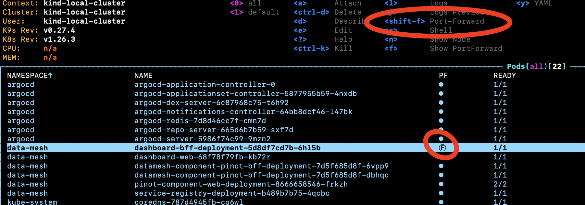

# The dashboard web server
This component serves up the dash-mesh windowing dashboard.

It has its own dedicated backend (backend-for-frontend, or "BFF") which communicates with the service registry serves up json data in a way optimised for the web dashboard.
See [here](../server/readme.md) for the BFF.


## Building 

We use [Makefile](https://www3.nd.edu/~zxu2/acms60212-40212/Makefile.pdf)s to build for its simple job dependency trees between jobs. 
The script for each task itself called from the Makefile is done in a [build.sh](./build.sh) bash script.

```bash
# For quicklyg building/running on your machine:
make runLocal

# For building and running in docker (the way the [github actions](../.github/workflows/build-web.yml) build the software), run:
make run

# or just for building
make buildDocker
```

## Debugging Locally

For local development, you can run the full data-mesh stack (see [here](https://kindservices.github.io/idea-labs/data-mesh/running.html)).

With those components running, you can choose to "port forward" the dashboard BFF component so that you host machine can access the backend server. (Use k9s, then shift+f when selecting the dashboard-bff component):



You then just have to update [src/routes/api/settings.js](./src/routes/api/settings.js) to change the BFF url to localhost rather than the k9s server name (just uncomment the localhost and comment out the other one)

You can then run the web server locally using `make runLocally`.

### Spinning up the BFF
The backend-for-frontend is, by design, tightly coupled with the web service, and so lives in this repository.

see the [../server](../server/readme.md) for notes on running the BFF.
